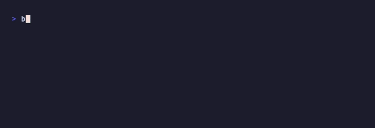

# @avelor/bifrost

Self-hosted WebSocket tunnel relay. Expose a local port through your own server — no third-party services, no SSH, no cloud accounts.

```
Internet ──► your server (tunnel.example.com:443)
                │
                ▼  (reverse proxy to 127.0.0.1)
         bifrost serve :9001
                │
                │  WebSocket (Bearer token)
                │
         bifrost connect (your machine)
                │
                │  HTTP
                │
         localhost:3000 (your dev server)
```

Single dependency (`ws`). Requires Node.js 18+.



## Installation

```bash
npm install -g @avelor/bifrost
```

## Quick start

**On your server:**

```bash
# Issue a token
bifrost token issue --global
#
#   id:     a1b2c3d4
#   scope:  global
#   token:  bf_...
#
#   → run on your machine:
#   bifrost use <endpoint> bf_...

# Start the relay
bifrost serve --port 9001 --host 127.0.0.1 --daemon
```

**On your machine:**

```bash
bifrost use wss://tunnel.example.com bf_...
bifrost connect 3000
```

Your local port 3000 is now reachable at `tunnel.example.com`.

## Commands

### Server

| Command | Description |
|---|---|
| `bifrost serve [--port N] [--host H] [--daemon]` | Start the relay |
| `bifrost stop` | Stop the daemon |
| `bifrost status` | Daemon status |

`--host` defaults to `0.0.0.0`. When running behind a reverse proxy, pass `--host 127.0.0.1` to prevent direct access to the relay port.

### Tokens

| Command | Description |
|---|---|
| `bifrost token issue --scope <name>` | Token scoped to one subdomain |
| `bifrost token issue --global` | Token valid for all subdomains |
| `bifrost token list` | List active tokens (no raw values) |
| `bifrost token revoke <id>` | Revoke a token by id |

`bifrost token issue` without a flag is an error — the scope must be explicit.

### Client

| Command | Description |
|---|---|
| `bifrost use <endpoint> <token>` | Save endpoint and token to `~/.config/bifrost/` |
| `bifrost connect <port>` | Expose localhost:<port> through the relay |
| `bifrost connect <port> --name <name>` | Use a specific subdomain |
| `bifrost connect <port> --run "cmd"` | Start a process and tunnel it |

## Deploying the relay

### Reverse proxy — nginx

```nginx
server {
    listen 443 ssl;
    server_name tunnel.example.com *.tunnel.example.com;

    ssl_certificate     /etc/letsencrypt/live/example.com/fullchain.pem;
    ssl_certificate_key /etc/letsencrypt/live/example.com/privkey.pem;

    location / {
        proxy_pass         http://127.0.0.1:9001;
        proxy_http_version 1.1;
        proxy_set_header   Upgrade    $http_upgrade;
        proxy_set_header   Connection "upgrade";
        proxy_set_header   Host       $host;
        proxy_set_header   X-Real-IP  $remote_addr;
        proxy_read_timeout 3600s;
    }
}
```

> The `*.tunnel.example.com` wildcard requires a wildcard TLS certificate (Let's Encrypt DNS challenge).

### Reverse proxy — Apache

```apache
<VirtualHost *:443>
    ServerName tunnel.example.com

    SSLEngine on
    SSLCertificateFile    /etc/letsencrypt/live/example.com/fullchain.pem
    SSLCertificateKeyFile /etc/letsencrypt/live/example.com/privkey.pem

    RewriteEngine On
    RewriteCond %{HTTP:Upgrade} websocket [NC]
    RewriteCond %{HTTP:Connection} upgrade [NC]
    RewriteRule ^/_bifrost ws://127.0.0.1:9001/_bifrost [P,L]

    ProxyPass        / http://127.0.0.1:9001/
    ProxyPassReverse / http://127.0.0.1:9001/
    ProxyPreserveHost On
</VirtualHost>
```

### systemd service

```ini
# /etc/systemd/system/bifrost.service
[Unit]
Description=Bifrost Relay
After=network.target

[Service]
Type=simple
User=www-data
ExecStart=bifrost serve --port 9001 --host 127.0.0.1
Restart=on-failure
RestartSec=5

[Install]
WantedBy=multi-user.target
```

```bash
systemctl enable --now bifrost
curl https://tunnel.example.com/_bifrost/ping  # → ok
```

## Token management

Tokens are stored in `~/.config/bifrost/tokens.json` on the server. Raw values are shown once at issuance and never stored — only the SHA-256 hash is kept.

### Subdomain routing

A token issued with `--scope preview` can only connect as `preview.tunnel.example.com`. A global token can connect under any name. The scope is validated on every WebSocket handshake.

```bash
bifrost connect 3000 --name preview
# → tunnel active → https://preview.tunnel.example.com
```

Your reverse proxy and DNS must route `*.tunnel.example.com` to the relay for named tunnels to work.

> **Domain naming requirement:** the relay extracts the tunnel name from the `Host` header by matching the pattern `<name>.tunnel.<tld>`. The literal segment `.tunnel.` must appear in your domain. `preview.tunnel.example.com` works; `preview.relay.example.com` or `preview.example.com` do not — the relay would treat those as the default tunnel instead of routing by name.

## Client reconnection

The client reconnects automatically on disconnect with exponential backoff:

```
1s → 2s → 4s → 8s → 16s → 30s (cap)
```

Retries reset to zero on each successful connection. Reconnection stops only if the server explicitly rejects the handshake (wrong token or scope mismatch — WebSocket close code `1008`).

## Config files

All files live under `~/.config/bifrost/`:

| File | Purpose |
|------|---------|
| `config.json` | Client config: `endpoint` and `token` |
| `tokens.json` | Server token store (hashed) |
| `bifrost.pid` | Daemon PID |
| `bifrost.log` | Daemon stdout/stderr |

## How it works

1. The relay starts an HTTP + WebSocket server on the configured port.
2. The client connects to `/_bifrost` (or `/_bifrost/<name>`) via WebSocket with a Bearer token.
3. The relay validates the token and its scope against the requested tunnel name.
4. Incoming HTTP requests are serialized (method, URL, headers, base64 body) and forwarded to the client over the WebSocket.
5. The client forwards them to `localhost:<port>` and sends the response back.
6. The relay writes the response to the original HTTP caller.

## Security

- Tokens are SHA-256 hashed at rest. Raw values are never logged or stored.
- Scoped tokens are validated against the tunnel name on every handshake — a `preview` token cannot connect as `staging`.
- The relay pings every connected client every 30 seconds. Clients that do not respond are terminated, preventing ghost entries from holding memory or blocking a name.
- The pending request queue is capped at 256 entries. Excess requests receive `429 Too Many Requests` immediately.
- Run the relay with `--host 127.0.0.1` behind a reverse proxy so it is not directly reachable from the internet.

## License

MIT © Avelor
